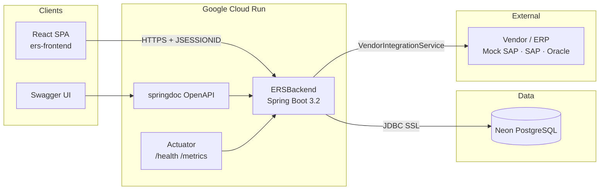
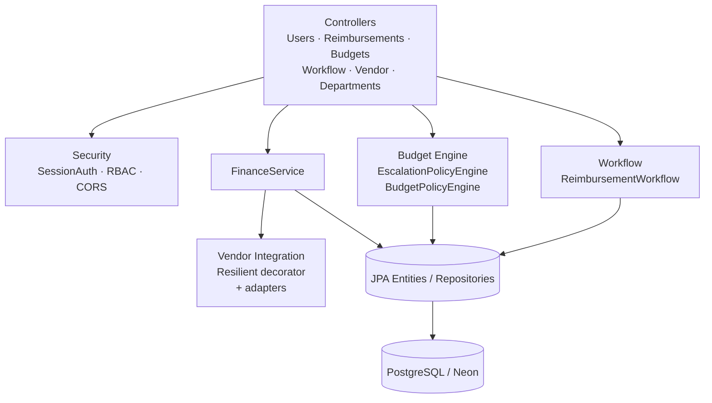
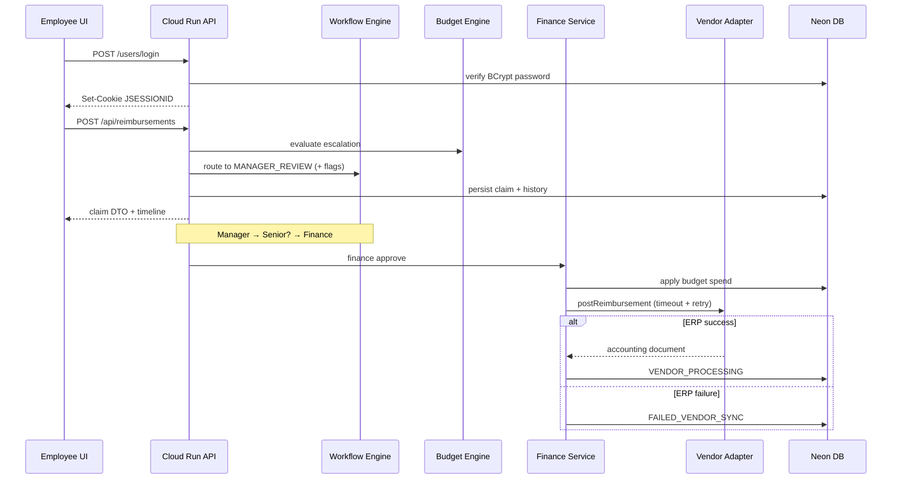

# Architecture

System architecture for the **Employee Reimbursement System (ERS)** by **Madasu Rakesh**.

---

## High-level system



---

## Backend module map



---

## Request lifecycle (reimbursement)



---

## Authentication

| Concern | Implementation |
|---------|----------------|
| Credential store | PostgreSQL `users` table; passwords hashed with **BCrypt** |
| Login | `POST /users/login` → validates credentials → `SessionAuthService.establishSession` |
| Session | Server-side `HttpSession` (`JSESSIONID` cookie) + Spring `SecurityContext` |
| Frontend | Axios `withCredentials: true`; UI mirror in `sessionStorage` |
| Authorization | Spring Security method/URL RBAC: `employee`, `manager`, `senior_manager`, `finance`, `admin` |
| Logout | `POST /users/logout` invalidates session |
| Production cookies | `Secure` + `SameSite=None` for cross-origin SPA; Cloud Run **session affinity** |

Unauthenticated API calls receive JSON `401`. Insufficient role receives JSON `403`.

---

## Workflow

Multi-stage state machine documented in [WORKFLOW.md](WORKFLOW.md):

```text
Submitted → Manager Review → (Senior Manager) → Finance Review
         → Pending Vendor Confirmation → Vendor Processing → Paid
```

- Escalation flags set at submit (`requiresSeniorReview`, amount/budget reasons).
- Every transition appends `approval_history`.
- Admin-configurable rules via `PUT /api/workflow` (`WorkflowConfig`).

---

## Budget Engine

| Component | Responsibility |
|-----------|----------------|
| `EscalationPolicyEngine` | Remaining budget math; amount threshold; escalate-on-exceed |
| `BudgetPolicyEngine` | Facade for callers / legacy path hints |
| `BudgetService` | Dashboard aggregates; optimistic concurrency on spend |
| Spend timing | Applied when finance commits (enters vendor confirmation) |

Escalation inputs: claim amount, department remaining budget, `WorkflowConfig` thresholds.

---

## Vendor Integration

Port/adapter design ([INTEGRATION.md](INTEGRATION.md)):

```text
FinanceService
    → VendorIntegrationService (port)
        → ResilientVendorIntegrationService (timeout + retry)
            → MockSapVendorService | SapVendorService | OracleErpVendorService | …
```

Configuration: `ers.vendor.provider` / `ERS_VENDOR_PROVIDER`. Business services never import a concrete ERP client.

---

## Deployment topology

| Layer | Technology |
|-------|------------|
| API hosting | Google Cloud Run (container from `ERSBackend/Dockerfile`) |
| Database | Neon PostgreSQL (SSL JDBC) |
| CI/CD | GitHub Actions → Artifact Registry → Cloud Run |
| Local parity | Docker Compose (`backend`, `frontend`, optional `db`) |
| Docs / ops | springdoc OpenAPI, Actuator health & metrics |

Full runbooks: [DEPLOYMENT.md](DEPLOYMENT.md).

---

## Repository layout

```text
.
├── ERSBackend/                 Spring Boot API
│   ├── Dockerfile
│   └── src/main/java/com/reimbursement/
│       ├── controller/
│       ├── security/
│       ├── workflow/
│       ├── policy/             Budget / escalation engines
│       ├── integration/vendor/ ERP adapters
│       └── config/             OpenAPI, CORS
├── ers-frontend/               React + TypeScript SPA
│   ├── Dockerfile
│   └── nginx.conf
├── .github/workflows/          CI + Cloud Run deploy
├── docker-compose.yml
├── DEPLOYMENT.md
├── ARCHITECTURE.md
├── WORKFLOW.md
└── INTEGRATION.md
```
