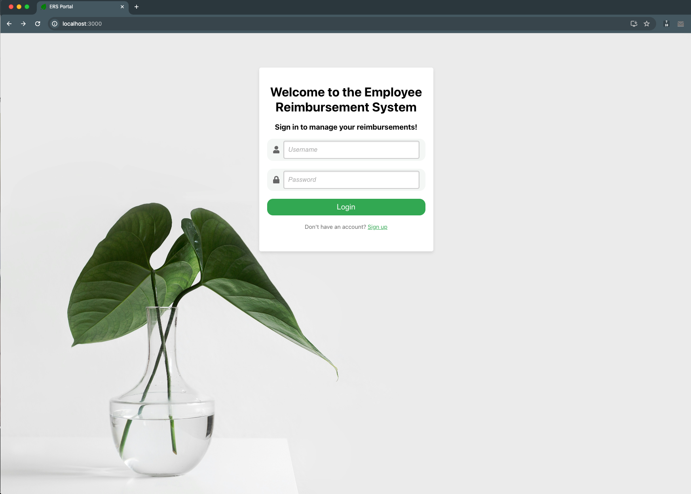
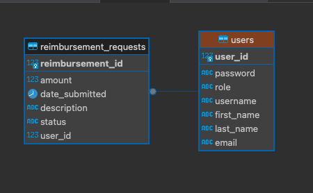

# Employee Reimbursement System (ERS)

**Author:** Madasu Rakesh  
**Repository:** [FinFlow](https://github.com/rakeshrakhi9392/FinFlow)

Enterprise-style full-stack application for submitting, approving, budgeting, and posting employee reimbursements to a vendor/ERP layer.



---

## Overview

| Layer | Stack |
|-------|--------|
| **Frontend** | React 18, TypeScript, Axios, Recharts |
| **Backend** | Spring Boot 3.2, Spring Security, Spring Data JPA |
| **API docs** | springdoc OpenAPI 3 / Swagger UI |
| **Observability** | Spring Boot Actuator (`/actuator/health`, `/actuator/metrics`) |
| **Database** | PostgreSQL (local) or **Neon PostgreSQL** (production) |
| **Deploy** | Docker · Docker Compose · GitHub Actions → **Google Cloud Run** |

---

## Features

### Enterprise approval workflow
- Pipeline: **Submitted → Manager → Senior Manager (optional) → Finance → Vendor Confirmation → Paid**
- Escalation by amount threshold and remaining department budget
- Approval comments, timestamps, and full history / timeline UI  
- Details: [WORKFLOW.md](WORKFLOW.md)

### Budget engine
- Remaining-budget checks and configurable escalation
- Spend applied at finance commitment (vendor confirmation)
- Role-gated budget dashboard

### Vendor / ERP integration
- Pluggable `VendorIntegrationService` with **Mock SAP** (SAP / Oracle / FX stubs ready)
- Timeout, retry, and sync states (`PENDING_VENDOR_CONFIRMATION`, `FAILED_VENDOR_SYNC`)  
- Details: [INTEGRATION.md](INTEGRATION.md)

### Security & RBAC
- Session cookies (`JSESSIONID`) + BCrypt passwords
- Roles: `employee`, `manager`, `senior_manager`, `finance`, `admin`

### Production readiness
- Swagger UI & OpenAPI JSON
- Actuator health (Cloud Run probes) and metrics
- Docker images for API and SPA
- Compose stack for local parity
- GitHub Actions deploy to Cloud Run + Neon  
- Runbook: [DEPLOYMENT.md](DEPLOYMENT.md) · Diagrams: [ARCHITECTURE.md](ARCHITECTURE.md)

---

## Architecture (summary)

```text
React SPA ──HTTPS + session cookie──► Spring Boot on Cloud Run
                                              │
                                              ▼
                                       Neon PostgreSQL
                                              ▲
Finance approval ──► Resilient Vendor Adapter (Mock SAP / ERP)
```

Full diagrams and module explanations: [ARCHITECTURE.md](ARCHITECTURE.md).

---

## Quick start (local)

### Prerequisites
- JDK 17+, Maven  
- Node.js 20+  
- PostgreSQL **or** Docker  

### Backend

```bash
cd ERSBackend
./mvnw spring-boot:run
```

Defaults: `jdbc:postgresql://localhost:5432/reimbursement` (override with env vars — see `.env.example`).

### Frontend

```bash
cd ers-frontend
npm install
npm start
```

Open [http://localhost:3000](http://localhost:3000).

### Docker Compose

```bash
cp .env.example .env
docker compose --profile local-db up --build
```

| Service | URL |
|---------|-----|
| Frontend | http://localhost:8081 |
| API | http://localhost:8080 |
| Swagger UI | http://localhost:8080/swagger-ui.html |
| Health | http://localhost:8080/actuator/health |

---

## API documentation & ops endpoints

| Endpoint | Description |
|----------|-------------|
| `/swagger-ui.html` | Interactive Swagger UI |
| `/v3/api-docs` | OpenAPI 3 specification |
| `/actuator/health` | Health (public) |
| `/actuator/info` | Build/app info (public) |
| `/actuator/metrics` | Metrics (ADMIN / FINANCE session) |

Authenticate in Swagger by calling `POST /users/login` first (browser will store the session cookie).

---

## Authentication

1. Register: `POST /users`  
2. Login: `POST /users/login` → server creates HTTP session and returns user profile  
3. Subsequent calls send `JSESSIONID` via Axios `withCredentials`  
4. Logout: `POST /users/logout`  

UI route guards use a `sessionStorage` mirror; **authoritative auth is the server session**.  
Cross-origin production (SPA ≠ API host) uses `Secure` + `SameSite=None` cookies and CORS allow-listing — see [DEPLOYMENT.md](DEPLOYMENT.md).

---

## Workflow

Claims move through manager → optional senior manager → finance → vendor posting → paid. Admins configure escalation in `workflow_config`. See [WORKFLOW.md](WORKFLOW.md).

---

## Budget engine

`EscalationPolicyEngine` / `BudgetPolicyEngine` evaluate amount thresholds and remaining department budget at submit time; finance approval applies spend when entering vendor confirmation.

---

## Vendor integration

`FinanceService` talks only to the `VendorIntegrationService` port. `ResilientVendorIntegrationService` adds timeouts and retries around the configured adapter (`ERS_VENDOR_PROVIDER`). See [INTEGRATION.md](INTEGRATION.md).

---

## Deployment

| Target | How |
|--------|-----|
| Local containers | `docker compose --profile local-db up --build` |
| Database (prod) | Neon PostgreSQL JDBC + SSL |
| API (prod) | GitHub Actions → Artifact Registry → **Google Cloud Run** |
| Frontend (prod) | Build with `REACT_APP_API_BASE_URL` pointing at Cloud Run; host via Nginx/CDN |

Step-by-step secrets, Neon setup, and Cloud Run flags: **[DEPLOYMENT.md](DEPLOYMENT.md)**.

---

## Database

ER diagram:



Production schema defaults to Neon’s `public` schema. Local default schema can be `reimbursement_schema` (see `application.properties`).

---

## Requirements

Classic functional requirements: [requirements.md](requirements.md).

---

## Fork attribution

This project is an original full-stack implementation by **Madasu Rakesh**, published as **FinFlow** (`https://github.com/rakeshrakhi9392/FinFlow`).

It follows the widely taught **Employee Reimbursement System (ERS)** training problem domain (employee expense claims with manager review). That domain is a common educational brief used across many bootcamps and courses; this repository is **not** a verbatim copy of a single upstream codebase.

**Substantial original / extended work in this repository includes:**

- Multi-stage enterprise workflow with escalation and approval history  
- Budget / escalation policy engines and budget dashboard  
- Pluggable vendor/ERP integration with resilience (Mock SAP)  
- Role model expanded to senior manager, finance, and admin  
- Production packaging: OpenAPI, Actuator, Docker, Compose, GitHub Actions, Cloud Run + Neon documentation  

If you fork or reuse this work, retain the copyright notice in [LICENSE](LICENSE) and credit **Madasu Rakesh**.

---

## Documentation index

| Document | Contents |
|----------|----------|
| [ARCHITECTURE.md](ARCHITECTURE.md) | System & sequence diagrams, module map |
| [REVIEW.md](REVIEW.md) | Production review: architecture, tradeoffs, limitations, roadmap |
| [DEPLOYMENT.md](DEPLOYMENT.md) | Neon, Docker, Cloud Run, GitHub Actions |
| [WORKFLOW.md](WORKFLOW.md) | Approval lifecycle & APIs |
| [INTEGRATION.md](INTEGRATION.md) | Vendor/ERP adapters |
| [requirements.md](requirements.md) | Functional requirements |

---

## Author

**Madasu Rakesh**

